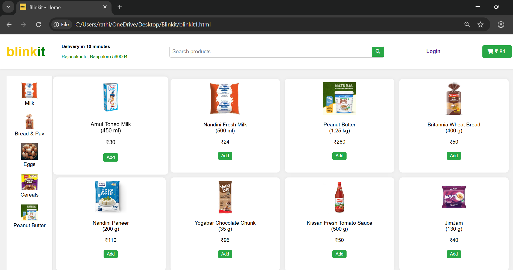
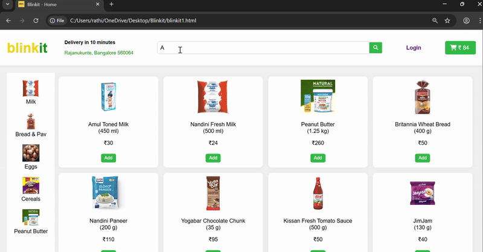

<h1>Blinkit - Front End</h1>

 A front end project of the E-commerce application Blinkit.The project was created using the HTML,CSS,Javascript and Angular JS .The project simulates real-world E-commerce functionalities like product browsing, cart management, and User Authentication.

<h2>Table of Contents</h2>

<ul>
  <li><a href="https://github.com/RathikPoojary2/Blinkit/blob/main/README.md#description">Description</a></li>
    <li><a href="https://github.com/RathikPoojary2/Blinkit/blob/main/README.md#motivation">Motivation </a></li>
  <li><a href="https://github.com/RathikPoojary2/Blinkit/blob/main/README.md#-features">Features</a></li>
  <li><a>Tech/Frameworks Used</a></li>
</ul>

<h2>Description</h2>

The Blinkit Clone is a simple grocery e-commerce platform that mimics official <a href="https://blinkit.com/cn/milk/cid/14/922?utm_source=google&utm_medium=cpc&utm_campaign=21439030315&utm_content=169426454132&utm_term=blinkit&gad_source=1&gad_campaignid=21439030315&gbraid=0AAAAADfkql5eHadZMsPwKXNZ1WUIzw4lc&gclid=Cj0KCQjwhO3DBhDkARIsANxrhTpaH3Q7iczyEQZJDkYY5lqKohPLDOvGKu2HIhcd-Bd-f0rbDuZMYCkaAhs9EALw_wcB" >Blinkit </a> UI and features.

It allows users to : 
<ul>
  <li>Browse Products</li>
  <li>Add products to a cart and view the total cost.</li>
  <li>Place orders (with a login check).</li>
</ul>

<h2>Motivation</h2>

The project was built as a learning exercise to practice.Since the point of this project was not to make great UI/UX design choices, I chose to create a clone of a well established product as to shorten my learning time and not to focus on the wrong thing.

The Blinkit Clone project was developed to strengthen my skills in front-end web development and to better understand the core principles behind e-commerce platforms.By recreating the look and feel of Blinkit, I aimed to practice building a responsive and interactive user interface while simulating real-world features such as product search, category filtering, cart management, and login validation.

<h2> Features</h2>
<h4> 1.Realtime Search</h4>

 Using the search you can filter the items.Case-insensitive and instant filtering without page reload

<h4>2. Sidebar with categories</h4>

Clicking on a category (Ex: Milk, Bread & Pav, Cereals) filters the product grid to show relevant items.

Each category is linked to its own product data.

<h4>3. Add to cart with local storage</h4>

Products can be added to the cart, and the cart icon updates with the total price.

Cart data persists across pages using localStorage.

<h4>4. Cart Page</h4>
<ul>
  <li>Displays all selected products with price, quantity, and total amount.</li>
  <li>Allows removing products from the cart.</li>
  <li>"Place Order" button with login check.</li>
</ul>

<h4>5. Login Page</h4>
<ul>
  <li>AngularJS-based login form with validation for email and password.</li>
  <li>Uses sessionStorage to simulate user login.</li>
  <li>Redirects to the cart page upon successful login.</li>
</ul>

